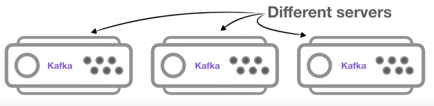
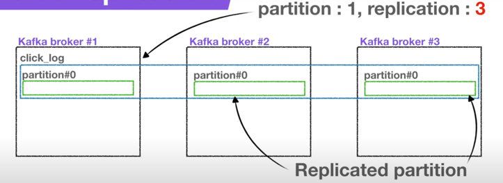
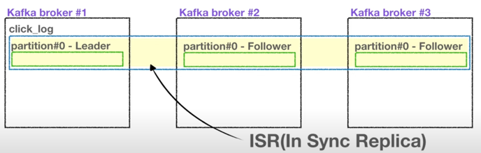
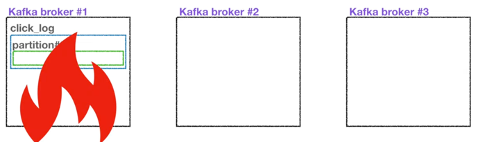
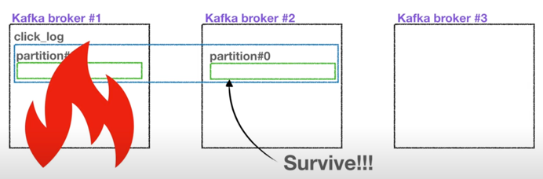
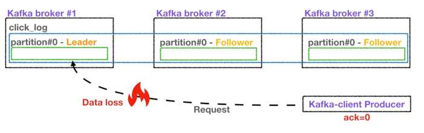
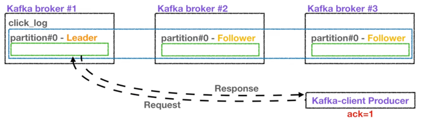
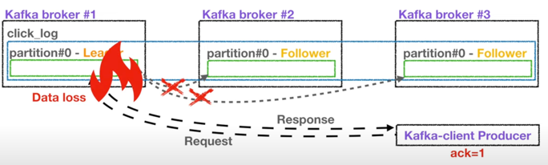
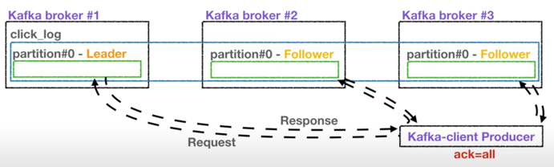
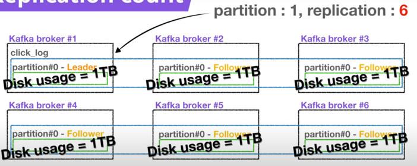

## Broker, Replication, ISR(In-Sync-Replication)

Kafka 운영에 있어서 아주 중요한 요소들이다. 

- Replication(복제)는 Kafka 아키텍쳐의 핵심이다. 
  - 클러스터에서 서버가 장애가 생길 때 카프카의 가용성을 보장하는 가장 좋은 방법은 복제이기 때문이다. 

- Kafka Broker는 Kafka가 설치되어 있는 서버 단위이다. 
- 보통 3개 이상의 Broker로 구성하여 사용하는 것을 권장한다. 
- 만약 파티션이 1개이고 replication이 1인 topic이 존재하고 Broker가 3대라면, Broker 3대 중 1대에 해당 토픽의 정보(데이터)가 저장된다.

- replication은 파티션의 복제를 뜻한다. 
- 만약, replication이 1이라면 파티션은 1개만 존재한다는 것이다.
- replication이 2라면 파티션은 원본 1개와 복제본 1개로 총 2개가 존재한다.
- replication이 3이라면 원본 1개와 복제본 2개로 존재하게 된다. 
- 다만, 브로커 개수에 따라서 replication 개수가 제한되는데, 브로커 수보다 replication의 수가 많을 수 없다. 

- 원본 1개의 파티션은 leader partition이다. 
- 나머지 2개의 파티션은 follower partition이다. 
- 위의 leader와 follower partition을 합쳐서 ISR이라고 본다.

- Replication은 파티션의 고가용성을 위해 사용된다. 
- 만약, 브로커가 3개인 Kafka에서 replication이 1이고 partition이 1인 topic이 존재한다고 가정해보자.
- 갑자기 브로커가 어떠한 이유로 사용이 불가능하게 된다면, 더이상 해당 파티션은 복구할 수 없다.

- replication이 2인 경우는 파티션 1개가 죽더라도 follower 파티션이 존재하므로 복제본은 복구가 가능하다. 
- 남은 follower 파티션이 leader partition의 역할을 승계하게 되는 것이다. 

- leader 파티션과 follower 파티션의 역할은 다음과 같다.
- Producer가 Topic을 파티션에 데이터를 전달할 때, 전달받는 주체가 바로 leader 파티션이다.

 
- 프로듀서에는 ack라는 상세 옵션이 있다. 
  - ack를 통해 고가용성을 유지할 수 있는데, 이 옵션은 파티션의 replication과 관련이 있다.
- ack는 0, 1, all 옵션 3개 중 1개를 골라서 설정할 수 있다. 
- 먼저 0일 경우, Producer는 leader 파티션의 데이터를 전송하고 응답값은 받지 않는다.
- 그렇기 때문에 leader 파티션에 데이터가 정상적으로 전송됐는지 그리고 나머지 파티션에 정상적으로 복제되었는지 알 수 없다. 
- 이 때문에 속도는 빠르지만, 데이터 유실 가능성이 있다. 

- 1일 경우는 leader 파티션에 데이터를 전송하고, 데이터를 정상적으로 받았는지 응답값을 받는다. 
- 다만, 나머지 파티션에 복제되었는지 알 수 없다. 
- 만약, leader 파티션이 데이터를 받은 즉시 브로커가 장애가 난다면, 나머지 파티션에 데이터가 미처 전송되지 못한 상태이므로 이전에 ack 0 옵션과 마찬가지로 데이터 유실 가능성이 높다.

- 마지막 all 옵션은 1 옵션에 추가로 follower 파티션에 복제가 잘 이루어졌는지 응답값을 받는다. 
- leader 파티션에 데이터를 보낸 후 나머지 follower 파티션에도 데이터가 저장되는 것을 확인하는 절차를 거친다. 
- ack all 옵션을 사용할 경우 data 유실은 없다.
- 그렇지만 0, 1에 비해 확인하는 부분이 많아 속도가 현저히 느리다. 

- replication이 고가용성을 위해 중요한 역할을 한다면, replication의 개수가 많을 수록 좋은 것이 아닌가?
- replication의 개수가 많아지면, 그만큼 브로커의 리소스 사용량도 늘어난다. 
- 따라서 Kafka에 들어오는 데이터량과 retention date(저장 시간)를 잘 생각해서 replication 개수를 정하는 것이 좋다.
- 3개 이상의 브로커를 사용할 때 replication은 3으로 설정하는 것이 좋다. 
