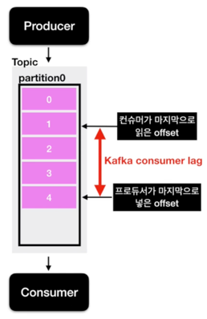
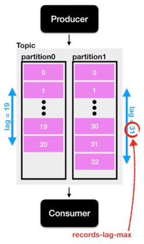

## Consumer Lag 

Kafka를 운영함에 있어서 중요한 모니터링 지표 중 하나이다. 

- Kafka Producer는 Topic의 파티션에 data를 넣게 된다. 
- 이 파티션에 데이터가 하나씩 들어가게 된다면 각 데이터는 offset이라고 하는 숫자가 붙게 된다. 
- 만약 파티션이 1개라고 가정해보자. 
- 파티션이 1개인 토픽에 프로듀서가 데이터를 넣을 경우 0부터 차례대로 숫자가 매겨지게 된다.
- 프로듀서가 데이터를 넣어주는 속도가 컨슈머가 데이터를 가져가는 속도보다 빠르다면?
  - 프로듀서가 넣은 데이터의 오프셋, 컨슈머가 가져간 데이터의 오프셋 2개의 오프셋 간의 차이가 발생하게 된다. 
  - 이것이 lag이다. 
- lag의 숫자를 통해 해당 토픽에 대해 파이프라인으로 연계되어 있는 프로듀서와 컨슈머의 상태에 대해 유추가 가능하다. 
  - 주로 컨슈머의 상태에 대해 볼때 사용한다.
  

- lag은 각 파티션의 오프셋을 기준으로 측정되기 때문에, 토픽에 여러 파티션이 존재할 경우, lag은 여러개가 존재할 수 있다. 
- 만약 consumer 그룹이 1개이고 파티션이 2개인 토픽에서 data를 가져간다면 lag은 2개가 측정될 수 있다. 
  - 이렇게 1개의 토픽과 컨슈머 그룹에 대한 lag이 여러개 존재할 수 있을 때 그 중 높은 숫자의 lag을 records-lag-max라고 한다. 

> lag은 2가지만 알면 된다. 
> 1. lag은 프로듀서 오프셋과 컨슈머 오프셋의 차이이다.
> 2. lag은 여러개가 존재할 수 있다. 

lag은 consumer가 성능이 안나오거나 비정상 동작을 하게 된다면 필연적으로 발생하기 때문에 주의 깊게 살펴볼 필요가 있다. 
