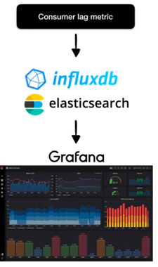
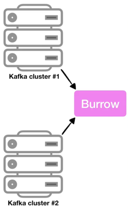

## Consumer lag 모니터링 애플리케이션, Kafka Burrow 

- Kafka Client 라이브러리를 사용해서 Java, Scala 같은 언어를 통해 Kafka Consumer 객체를 구현할 수 있다. 
  - 이때 구현한 Kafka Consumer 객체를 통해 현재 lag 정보를 가져올 수 있다. 
  - 만약, lag을 실시간으로 모니터링하고 싶다면 데이터를 elastic search나 influxdb 같은 저장소에 넣은 뒤 Grafana 대시보드를 통해 확인할 수 있다. 
- 하지만, Consumer 단위에서 lag을 모니터링하는 것은 아주 위험하고 운영요소가 많이 들어간다. 
  - Consumer 로직단에서 lag을 수집하는 것은 Consumer 상태에 dependency가 걸리기 때문이다. 
  - Consumer가 비정상적으로 종료되게 된다면 더이상 Consumer는 lag 정보를 보낼 수 없기 때문에 더이상 lag을 측정할 수 없다. 
  - 또한, 추가적으로 Consumer가 개발될 때마다 해당 컨슈머에 lag 정보를 특정 저장소에 저장할 수 있도록 로직을 개발해야 한다. 
  - 만약, Consumer lag을 수집할 수 없는 컨슈머라면 lag을 모니터링할 수 없기 때문에 운영이 매우 까다로워지게 된다.

- Burrow는 오픈소스로서 Golang으로 작성되었고, 현재 깃허브에 올라가있다. 
- Burrow는 Consumer lag 모니터링을 도와주는 독립적인 애플리케이션이다. 
  - 3가지 특징이 있다. 
    1. 멀티 카프카 클러스터 지원 : 카프카 클러스터가 여러개이더라도 Burrow Application 1개만 실행해서 연동한다면 Kafka 클러스터들에 붙은 컨슈머 lag을 모두 모니터링할 수 있다. 
    2. Sliding Window를 통한 Consumer의 status 확인 
       - Burrow에는 Sliding Window를 통해서 Consumer의 status를 ERROR, WARNING, OK로 표현할 수 있도록 하였다. 
       - 만약 데이터양이 일시적으로 증가하면서 Consumer offset이 증가되고 있으면 WARNING으로 정의된다. 
       - 만약 데이터양이 많아지고 있는데 Consumer가 데이터를 가져가지 않으면 ERROR로 정의하여 실제로 Consumer가 문제가 있는지 여부를 알 수 있다. 
    3. HTTP api 제공 : Burrow에 정의한 HTTP api를 통해 정보를 조회할 수 있게 한다. 
       - HTTP api를 호출해서 response 받은 데이터를 시계열 DB와 같은 곳에 저장하는 application을 만들어서 활용할 수도 있다. 
