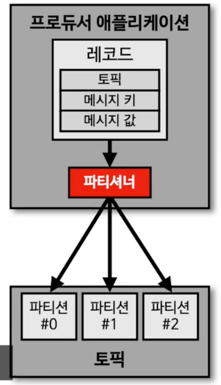
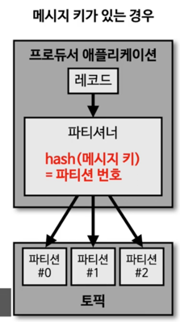
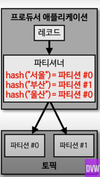

## Partitioner 

파티셔너는 Kafka Producer의 중요 개념 중 하나이다. 

- 프로듀서가 데이터를 보내게 되면 무조건 파티셔너를 통해서 브로커로 데이터가 전송된다. 
- 파티셔너는 데이터를 Topic에 어떤 파티션에 넣을지 결정하는 역할을 한다. 
- 레코드에 포함된 메시지 키 또는 메시지 값에 따라서 파티션의 위치가 결정되게 된다. 
- 프로듀서를 사용할 때, 파티셔너를 따로 설정하지 않는다면 Uniform Sticky Partitioner로 설정이 된다. 
  - 이 파티셔너는 메시지 키가 있을 때와 없을 때 다르게 동작한다. 

- 메시지 키를 가진 레코드는 파티셔너에 의해 특정한 해시 값으로 생성 된다.
- 이 해시 값을 기준으로 어느 파티션에 들어갈 지 정해지게 된다.

- 동일한 메시지 키를 가진 레코드는 동일한 해시 값을 만들기 때문에 항상 동일한 파티션에 들어가는 것을 보장한다.
  - 따라서 순서를 지켜서 데이터를 처리할 수 있다는 장점이 있다.
  - 파티션 1개의 내부에서는 Queue 처럼 동작하기 때문에 순서를 지킬 수 있는 것이다. 

##### 메시지 키가 없는 경우 

- 메시지 키가 없는 레코드는 Round Robin으로 파티션에 들어가게 된다. 
- 단, 전통적인 Round Robin 방식과는 다르다. 
- Uniform Sticky Partitioner는 Producer에서 배치로 모을 수 있는 최대한의 레코드를 모아서 파티션으로 데이터를 보내게 된다. 
  - 이렇게 배치단위로 데이터를 보낼 때 파티션에 Round Robin 방식으로 돌아가면서 데이터를 넣게 된다.  
  - 메시지 키가 없는 데이터들은 파이션에 적절히 분배되는 것이다.  

##### 직접 개발한 파티셔너 

기본 파티셔너가 아닌 직접 개발한 파티셔너도 프로듀서에서 설정할 수 있다. 

> Kafka에서는 커스텀 파티셔너를 만들 수 있도록 Partitioner 인터페이스를 제공하고 있다. 
> Partitioner 인터페이스를 사용해서 커스텀 파티셔너 클래스를 만들면, 메시지 키 또는 메시지 값 또는 토픽 이름에 따라서 어느 파티션에 데이터를 보낼 것인지 정할 수 있다. 

파티셔너를 통해서 데이터 처리량을 늘릴 수도 있다. 

- 기본적으로 10개의 파티션이 있다고 할 때, 커스텀 파티셔너를 만들어서 8개는 빠르게 처리해야 하는 데이터, 2개는 일반적인 데이터를 넣도록 개발하면 된다. 
- 이것은 마치 AMQP 기반 메시징 시스템 같은 곳에서 우선 순위 큐를 만드는 것과 약간 비슷하다고 보면 될 것이다. 
