# kafka

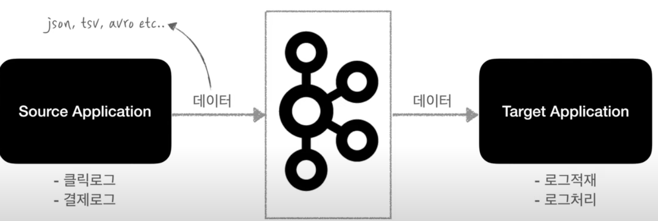

- Kafka는 Source Application과 Target Application의 결합(coupling)을 약하게 하기 위해 나왔다.
- Source Application은 Kafka에 데이터를 전송하고, Target Application은 Kafka에서 Data를 가져오면 된다. 
- Source Application은 쇼핑몰의 클릭 로그, 결제 로그와 같은 데이터를 보낼 수 있다. 
- Target Application은 로그 적재, 로그 처리등의 역할을 한다. 
- Source Application에서 보낼 수 있는 데이터 포맷은 거의 제한이 없다. 

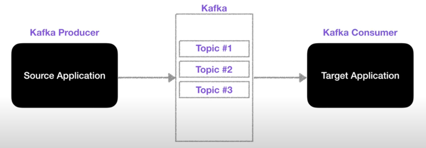

- Kafka는 각종 데이터를 담는 Topic이라는 개념이 있는데, 쉽게 말하면 Queue이다.  
- Queue에 데이터를 넣는 역할은 Producer가 하고, Queue에 데이터를 가져가는 역할은 Consumer가 한다. 
- Producer와 Consumer는 라이브러리로 되어있어서, 애플리케이션에서 구현이 가능하다. 

> Kafka는 fault tolerant(고가용성)으로 서버 이슈가 생기거나 갑작스럽게 렉(전원이) 내려간다거나 하는 상황에서도 데이터를 손실 없이 복구할 수 있다.
> 또한, 낮은 지연(latency)과 높은 처리량(throughput)을 통해 아주 효과적으로 데이터를 아주 많이 처리할 수 있다.
> 빅데이터를 처리할 때 Kafka를 많이 쓴다. 

## Topic

Kafka에는 다양한 데이터가 들어갈 수 있는데, 이때 이 데이터가 들어갈 수 있는 공간을 Topic이라고 한다. 

- Kafka Topic은 일반적인 AMQP와는 다른 동작을 한다. 

- Kafka에서는 Topic을 여러개 생성할 수 있다. 
- Topic은 데이터베이스의 테이블이나 파일 시스템의 폴더와 유사한 성질을 가지고 있다.
- 이 Topic에 Producer가 데이터를 넣게 되고, Consumer는 데이터를 가져가게 된다.

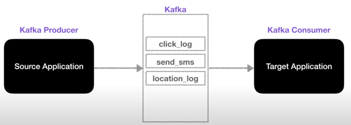

- Topic은 이름을 가질 수 있는데, 목적에 따라 무슨 데이터를 담는지 명확하게 명시하면 추후 유지보수 시 편리하게 관리할 수 있다.

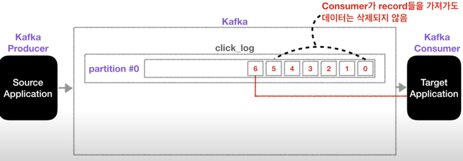

- 하나의 Topic은 여러개의 파티션으로 구성될 수 있으며, 첫번째 파티션 번호는 0번부터 시작한다. 
- 하나의 파티션은 큐와 같이 내부에 데이터가 파티션 끝에서부터 차곡차곡 쌓이게 된다. 
- Topic에 Kafka Consumer가 붙게 되면 데이터를 가장 오래된 순서대로 가져가게 된다. 
- 더이상 데이터가 들어오지 않으면, Consumer는 또 다른 데이터가 들어올 때까지 기다린다. 
- 이때, Consumer가 데이터를 가져가더라도 **데이터는 삭제되지 않고** 파티션에 그대로 남게 된다.

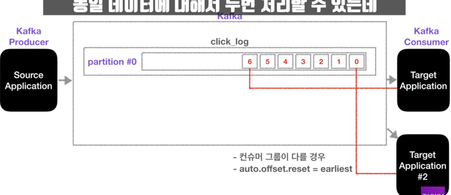

- 파티션에 남은 데이터는 누가 들고 가는 것인가?
  - 새로운 Consumer가 붙었을 때 0번부터 다시 가져갈 수 있다. 
  - 다만, 컨슈머 그룹이 달라야 하고, auto.offset.reset = earliest 설정이 되어있어야 한다. 
  - 이처럼 사용할 경우, 동일 데이터에 대해 2번 처리할 수 있게 되는데, 이는 Kafka를 사용하는 아주 중요한 이유이기도 하다. 

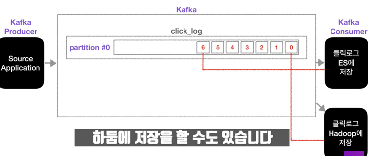

- 클릭로그를 분석하고 시각화 하기 위해 Elastic Search에 저장하기도 하고, 클릭로그를 백업하기 위해 Hadoop에 저장하기도 한다.

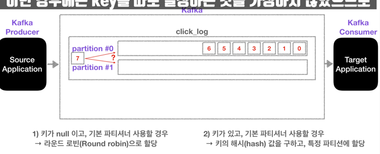

- 파티션이 여러 개인 경우, 데이터가 들어갈 곳을 지정하기 위해 키를 지정할 수 있다. 
- 키가 null이고(키를 지정하지 않음), 기본 파티셔너를 사용한다면 Round Robin으로 파티션이 지정되어 할당한다. 
- 키가 있고, 기본 파티셔너를 사용할 경우 키의 hash값을 구하고 특정 파티션에 할당한다. 

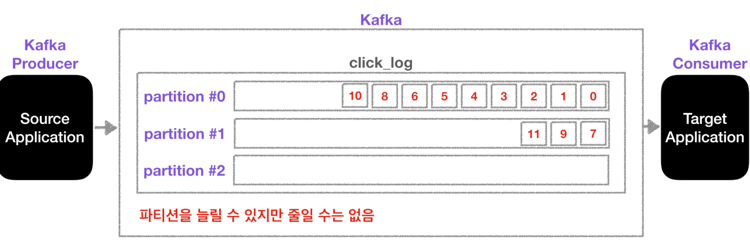

- 파티션을 늘리는 것은 조심해야 한다.
- 파티션을 늘리는 것은 가능하지만, 파티션을 줄이는 것은 불가능하기 때문이다. 
- 파티션을 늘리는 이유?
  - 파티션을 늘리면 컨슈머의 개수를 늘려서 데이터 처리를 분산시킬 수 있다. 

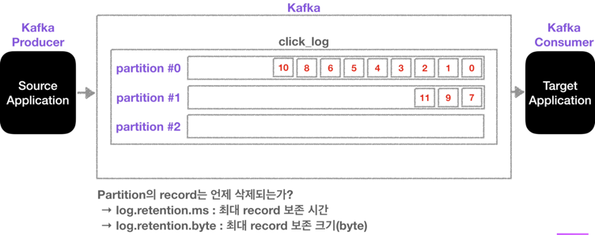

- 파티션의 데이터는 언제 삭제될까?
  - 삭제되는 타이밍은 옵션에 따라 다르다. 
  - 레코드가 저장되는 최대 시간과 크기를 지정할 수 있다.
    - log.retention.ms : 최대 record 보존 시간 
    - log.retention.byte : 최대 보존 크기(byte) 
  - 이를 지정하게 되면, 일정 기간 또는 용량동안 데이터를 저장할 수 있게 되고 적절하게 데이터가 삭제될 수 있도록 설정할 수 있다. 

## Broker, Replication, ISR(In-Sync-Replication)

Kafka 운영에 있어서 아주 중요한 요소들이다. 

- Replication(복제)는 Kafka 아키텍쳐의 핵심이다. 
  - 클러스터에서 서버가 장애가 생길 때 카프카의 가용성을 보장하는 가장 좋은 방법은 복제이기 때문이다. 

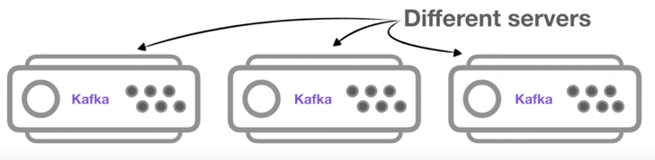

- Kafka Broker는 Kafka가 설치되어 있는 서버 단위이다. 
- 보통 3개 이상의 Broker로 구성하여 사용하는 것을 권장한다. 
- 만약 파티션이 1개이고 replication이 1인 topic이 존재하고 Broker가 3대라면, Broker 3대 중 1대에 해당 토픽의 정보(데이터)가 저장된다.

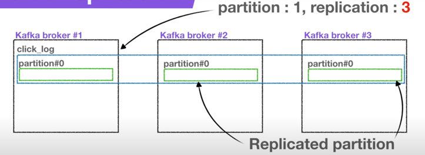

- replication은 파티션의 복제를 뜻한다. 
- 만약, replication이 1이라면 파티션은 1개만 존재한다는 것이다.
- replication이 2라면 파티션은 원본 1개와 복제본 1개로 총 2개가 존재한다.
- replication이 3이라면 원본 1개와 복제본 2개로 존재하게 된다. 
- 다만, 브로커 개수에 따라서 replication 개수가 제한되는데, 브로커 수보다 replication의 수가 많을 수 없다. 

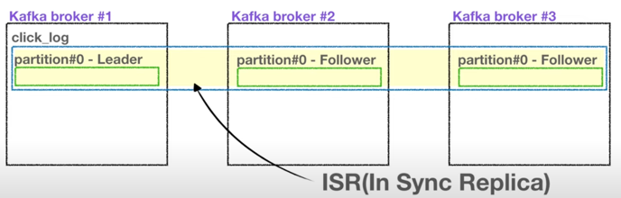

- 원본 1개의 파티션은 leader partition이다. 
- 나머지 2개의 파티션은 follower partition이다. 
- 위의 leader와 follower partition을 합쳐서 ISR이라고 본다.

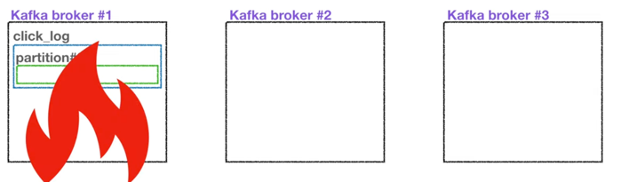

- Replication은 파티션의 고가용성을 위해 사용된다. 
- 만약, 브로커가 3개인 Kafka에서 replication이 1이고 partition이 1인 topic이 존재한다고 가정해보자.
- 갑자기 브로커가 어떠한 이유로 사용이 불가능하게 된다면, 더이상 해당 파티션은 복구할 수 없다.

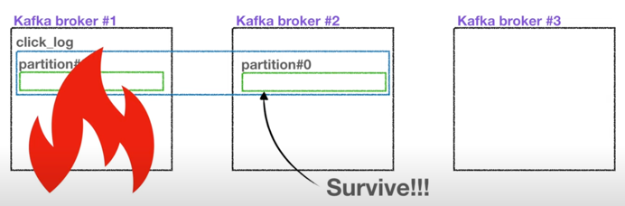

- replication이 2인 경우는 파티션 1개가 죽더라도 follower 파티션이 존재하므로 복제본은 복구가 가능하다. 
- 남은 follower 파티션이 leader partition의 역할을 승계하게 되는 것이다. 

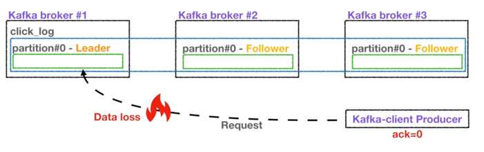

- leader 파티션과 follower 파티션의 역할은 다음과 같다.
- Producer가 Topic을 파티션에 데이터를 전달할 때, 전달받는 주체가 바로 leader 파티션이다.

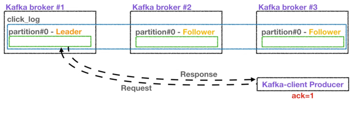
 
- 프로듀서에는 ack라는 상세 옵션이 있다. 
  - ack를 통해 고가용성을 유지할 수 있는데, 이 옵션은 파티션의 replication과 관련이 있다.
- ack는 0, 1, all 옵션 3개 중 1개를 골라서 설정할 수 있다. 
- 먼저 0일 경우, Producer는 leader 파티션의 데이터를 전송하고 응답값은 받지 않는다.
- 그렇기 때문에 leader 파티션에 데이터가 정상적으로 전송됐는지 그리고 나머지 파티션에 정상적으로 복제되었는지 알 수 없다. 
- 이 때문에 속도는 빠르지만, 데이터 유실 가능성이 있다. 

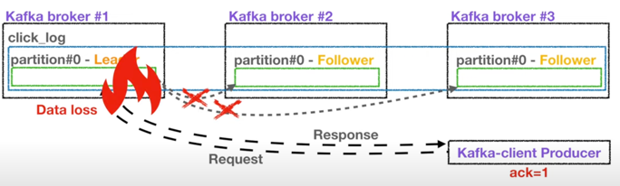

- 1일 경우는 leader 파티션에 데이터를 전송하고, 데이터를 정상적으로 받았는지 응답값을 받는다. 
- 다만, 나머지 파티션에 복제되었는지 알 수 없다. 
- 만약, leader 파티션이 데이터를 받은 즉시 브로커가 장애가 난다면, 나머지 파티션에 데이터가 미처 전송되지 못한 상태이므로 이전에 ack 0 옵션과 마찬가지로 데이터 유실 가능성이 높다.

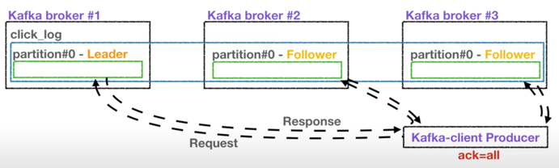

- 마지막 all 옵션은 1 옵션에 추가로 follower 파티션에 복제가 잘 이루어졌는지 응답값을 받는다. 
- leader 파티션에 데이터를 보낸 후 나머지 follower 파티션에도 데이터가 저장되는 것을 확인하는 절차를 거친다. 
- ack all 옵션을 사용할 경우 data 유실은 없다.
- 그렇지만 0, 1에 비해 확인하는 부분이 많아 속도가 현저히 느리다. 

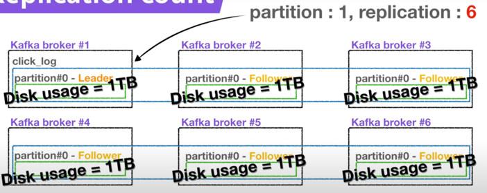

- replication이 고가용성을 위해 중요한 역할을 한다면, replication의 개수가 많을 수록 좋은 것이 아닌가?
- replication의 개수가 많아지면, 그만큼 브로커의 리소스 사용량도 늘어난다. 
- 따라서 Kafka에 들어오는 데이터량과 retention date(저장 시간)를 잘 생각해서 replication 개수를 정하는 것이 좋다.
- 3개 이상의 브로커를 사용할 때 replication은 3으로 설정하는 것이 좋다. 

## Partitioner 

파티셔너는 Kafka Producer의 중요 개념 중 하나이다. 

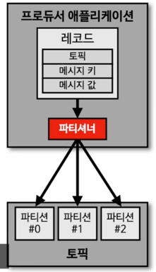

- 프로듀서가 데이터를 보내게 되면 무조건 파티셔너를 통해서 브로커로 데이터가 전송된다. 
- 파티셔너는 데이터를 Topic에 어떤 파티션에 넣을지 결정하는 역할을 한다. 
- 레코드에 포함된 메시지 키 또는 메시지 값에 따라서 파티션의 위치가 결정되게 된다. 
- 프로듀서를 사용할 때, 파티셔너를 따로 설정하지 않는다면 Uniform Sticky Partitioner로 설정이 된다. 
  - 이 파티셔너는 메시지 키가 있을 때와 없을 때 다르게 동작한다. 

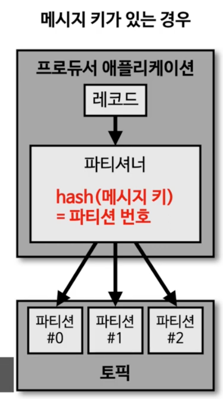

- 메시지 키를 가진 레코드는 파티셔너에 의해 특정한 해시 값으로 생성 된다.
- 이 해시 값을 기준으로 어느 파티션에 들어갈 지 정해지게 된다.

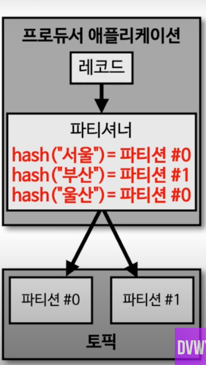

- 동일한 메시지 키를 가진 레코드는 동일한 해시 값을 만들기 때문에 항상 동일한 파티션에 들어가는 것을 보장한다.
  - 따라서 순서를 지켜서 데이터를 처리할 수 있다는 장점이 있다.
  - 파티션 1개의 내부에서는 Queue 처럼 동작하기 때문에 순서를 지킬 수 있는 것이다. 

##### 메시지 키가 없는 경우 

- 메시지 키가 없는 레코드는 Round Robin으로 파티션에 들어가게 된다. 
- 단, 전통적인 Round Robin 방식과는 다르다. 
- Uniform Sticky Partitioner는 Producer에서 배치로 모을 수 있는 최대한의 레코드를 모아서 파티션으로 데이터를 보내게 된다. 
  - 이렇게 배치단위로 데이터를 보낼 때 파티션에 Round Robin 방식으로 돌아가면서 데이터를 넣게 된다.  
  - 메시지 키가 없는 데이터들은 파이션에 적절히 분배되는 것이다.  

##### 직접 개발한 파티셔너 

기본 파티셔너가 아닌 직접 개발한 파티셔너도 프로듀서에서 설정할 수 있다. 

> Kafka에서는 커스텀 파티셔너를 만들 수 있도록 Partitioner 인터페이스를 제공하고 있다. 
> Partitioner 인터페이스를 사용해서 커스텀 파티셔너 클래스를 만들면, 메시지 키 또는 메시지 값 또는 토픽 이름에 따라서 어느 파티션에 데이터를 보낼 것인지 정할 수 있다. 

파티셔너를 통해서 데이터 처리량을 늘릴 수도 있다. 

- 기본적으로 10개의 파티션이 있다고 할 때, 커스텀 파티셔너를 만들어서 8개는 빠르게 처리해야 하는 데이터, 2개는 일반적인 데이터를 넣도록 개발하면 된다. 
- 이것은 마치 AMQP 기반 메시징 시스템 같은 곳에서 우선 순위 큐를 만드는 것과 약간 비슷하다고 보면 될 것이다. 

## Consumer Lag 

Kafka를 운영함에 있어서 중요한 모니터링 지표 중 하나이다. 

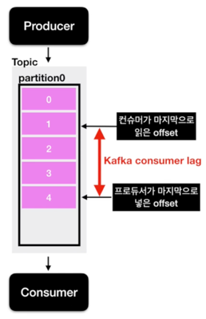

- Kafka Producer는 Topic의 파티션에 data를 넣게 된다. 
- 이 파티션에 데이터가 하나씩 들어가게 된다면 각 데이터는 offset이라고 하는 숫자가 붙게 된다. 
- 만약 파티션이 1개라고 가정해보자. 
- 파티션이 1개인 토픽에 프로듀서가 데이터를 넣을 경우 0부터 차례대로 숫자가 매겨지게 된다.
- 프로듀서가 데이터를 넣어주는 속도가 컨슈머가 데이터를 가져가는 속도보다 빠르다면?
  - 프로듀서가 넣은 데이터의 오프셋, 컨슈머가 가져간 데이터의 오프셋 2개의 오프셋 간의 차이가 발생하게 된다. 
  - 이것이 lag이다. 
- lag의 숫자를 통해 해당 토픽에 대해 파이프라인으로 연계되어 있는 프로듀서와 컨슈머의 상태에 대해 유추가 가능하다. 
  - 주로 컨슈머의 상태에 대해 볼때 사용한다.
  
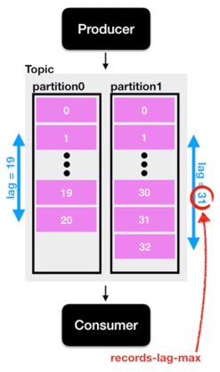

- lag은 각 파티션의 오프셋을 기준으로 측정되기 때문에, 토픽에 여러 파티션이 존재할 경우, lag은 여러개가 존재할 수 있다. 
- 만약 consumer 그룹이 1개이고 파티션이 2개인 토픽에서 data를 가져간다면 lag은 2개가 측정될 수 있다. 
  - 이렇게 1개의 토픽과 컨슈머 그룹에 대한 lag이 여러개 존재할 수 있을 때 그 중 높은 숫자의 lag을 records-lag-max라고 한다. 

> lag은 2가지만 알면 된다. 
> 1. lag은 프로듀서 오프셋과 컨슈머 오프셋의 차이이다.
> 2. lag은 여러개가 존재할 수 있다. 

lag은 consumer가 성능이 안나오거나 비정상 동작을 하게 된다면 필연적으로 발생하기 때문에 주의 깊게 살펴볼 필요가 있다. 

> [데브원영] : 아파치 카프카 for beginners를 참고하였습니다. 
