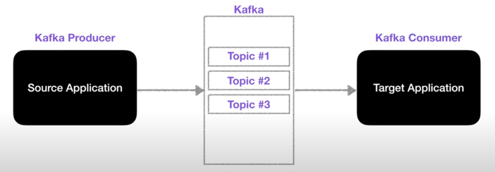

## Topic

Kafka에는 다양한 데이터가 들어갈 수 있는데, 이때 이 데이터가 들어갈 수 있는 공간을 Topic이라고 한다. 

- Kafka Topic은 일반적인 AMQP와는 다른 동작을 한다. 

- Kafka에서는 Topic을 여러개 생성할 수 있다. 
- Topic은 데이터베이스의 테이블이나 파일 시스템의 폴더와 유사한 성질을 가지고 있다.
- 이 Topic에 Producer가 데이터를 넣게 되고, Consumer는 데이터를 가져가게 된다.

- Topic은 이름을 가질 수 있는데, 목적에 따라 무슨 데이터를 담는지 명확하게 명시하면 추후 유지보수 시 편리하게 관리할 수 있다.

- 하나의 Topic은 여러개의 파티션으로 구성될 수 있으며, 첫번째 파티션 번호는 0번부터 시작한다. 
- 하나의 파티션은 큐와 같이 내부에 데이터가 파티션 끝에서부터 차곡차곡 쌓이게 된다. 
- Topic에 Kafka Consumer가 붙게 되면 데이터를 가장 오래된 순서대로 가져가게 된다. 
- 더이상 데이터가 들어오지 않으면, Consumer는 또 다른 데이터가 들어올 때까지 기다린다. 
- 이때, Consumer가 데이터를 가져가더라도 **데이터는 삭제되지 않고** 파티션에 그대로 남게 된다.

- 파티션에 남은 데이터는 누가 들고 가는 것인가?
  - 새로운 Consumer가 붙었을 때 0번부터 다시 가져갈 수 있다. 
  - 다만, 컨슈머 그룹이 달라야 하고, auto.offset.reset = earliest 설정이 되어있어야 한다. 
  - 이처럼 사용할 경우, 동일 데이터에 대해 2번 처리할 수 있게 되는데, 이는 Kafka를 사용하는 아주 중요한 이유이기도 하다. 

- 클릭로그를 분석하고 시각화 하기 위해 Elastic Search에 저장하기도 하고, 클릭로그를 백업하기 위해 Hadoop에 저장하기도 한다.

- 파티션이 여러 개인 경우, 데이터가 들어갈 곳을 지정하기 위해 키를 지정할 수 있다. 
- 키가 null이고(키를 지정하지 않음), 기본 파티셔너를 사용한다면 Round Robin으로 파티션이 지정되어 할당한다. 
- 키가 있고, 기본 파티셔너를 사용할 경우 키의 hash값을 구하고 특정 파티션에 할당한다. 

- 파티션을 늘리는 것은 조심해야 한다.
- 파티션을 늘리는 것은 가능하지만, 파티션을 줄이는 것은 불가능하기 때문이다. 
- 파티션을 늘리는 이유?
  - 파티션을 늘리면 컨슈머의 개수를 늘려서 데이터 처리를 분산시킬 수 있다. 

- 파티션의 데이터는 언제 삭제될까?
  - 삭제되는 타이밍은 옵션에 따라 다르다. 
  - 레코드가 저장되는 최대 시간과 크기를 지정할 수 있다.
    - log.retention.ms : 최대 record 보존 시간 
    - log.retention.byte : 최대 보존 크기(byte) 
  - 이를 지정하게 되면, 일정 기간 또는 용량동안 데이터를 저장할 수 있게 되고 적절하게 데이터가 삭제될 수 있도록 설정할 수 있다. 
