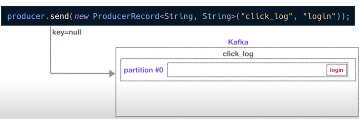
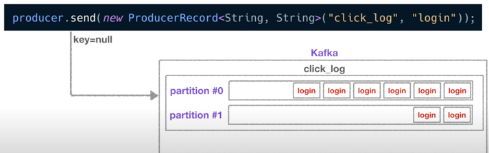
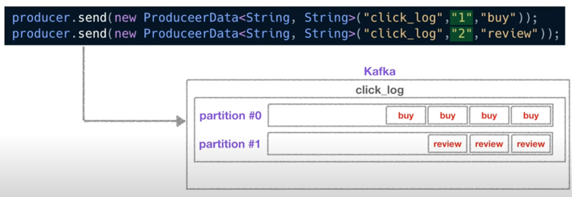
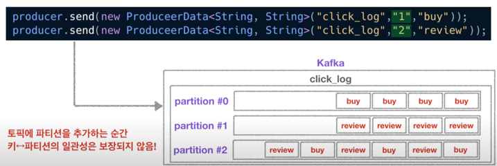

# Kafka Producer 

Producer는 데이터를 Kafka에 보내는 역할을 한다. 
- 예를 들어, 엄청난 양의 클릭 로그들을 대량으로, 그리고 실시간으로 Kafka에 적재할 때 Producer를 사용할 수 있다.

Producer는 데이터를 생산하는 역할을 한다. 
- 데이터를 Kafka Topic에 생성한다. 

### Producer의 역할 

1. Topic에 해당 메시지를 생성 
2. 특정 Topic으로 데이터를 publish 

- 여기까지가 기본적인 Kafka 데이터 전송 

3. 처리 실패/재시도 
    - Kafka Broker로 데이터를 전송할 때

### 코드 설명 

- key가 null인 데이터를 파티션이 1개인 토픽에 보내면 데이터가 차례대로 쌓인다. 

- 파티션이 2개라면 key가 null이므로 Round Robin으로 데이터가 쌓인다. 

#### Key가 설정된 경우 

- key가 존재하는 데이터를 Topic에 보내면 다음과 같이 동작한다. 
- buy value의 key를 1, review value의 key를 2라고 설정
  - Kafka는 key를 특정한 hash 값으로 변경시켜 파티션과 1대1 매칭을 시킨다. 
  - 따라서, 각 파티션에 동일 key의 value만 쌓이게 된다. 

만약 여기서 파티션을 1개더 추가한다면? 

- Topic에 새로운 파티션을 추가하는 순간 key와 파티션의 매칭이 깨지기 때문에 key와 파티션 연결은 보장하지 않는다. 
- key를 사용할 경우, 이 점을 유의해야 한다. 
